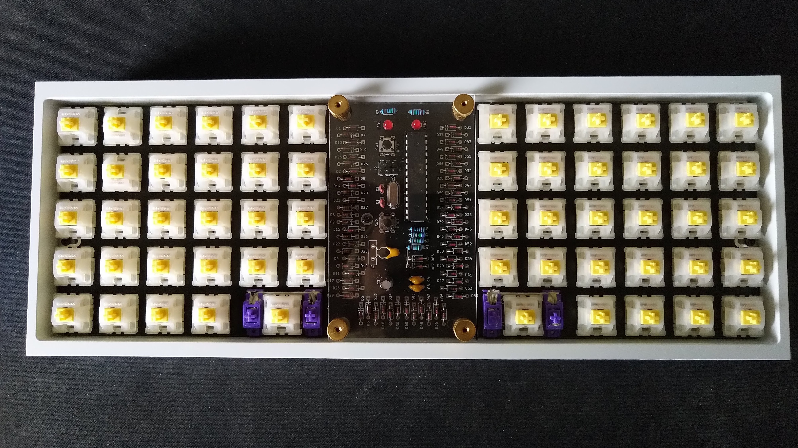

# Lumberjack - Through-hole ortholinear 60% keyboard PCB

Lumberjack is a split 5x12 ortholinear keyboard PCB using through-hole components only.

The goal of this project is to build an all through-hole component ortholinear PCB that fits in a standard 60% tray mount case.

Inspired by the [Plaid keyboard](https://github.com/hsgw/plaid).

* Designed to be easy to build with minimal soldering experience.
* All through-hole components, no SMD soldering required.
* Get that visible component aesthetic in a standard 60% tray-mount case.
* Supports both USB Mini and USB-C.
* Plateless or with FR4 switch plates.

# Ordering parts

See the [Bill of materials](BOM.md) for a detailed list of the required parts.

PCBs can be manufactuered by a variety of online PCB fabricators. You can use [PCBShopper](https://pcbshopper.com/) to search for the best price.

The zip file in the gerber directory contains the gerber files your fabricator will need to make the PCB [lumberjack.zip](https://github.com/peej/lumberjack-keyboard/blob/master/gerber/lumberjack.zip) PCB.

When uploading the gerber zip files, use the default PCB settings.

If you want to use a plate, there are gerbers for an FR4 plate. You will need two plates, one for each half of the keyboard.

# Construction

Solder all the components onto the top side of the PCB except the USB connector which should be on the back of the board. Leave the larger components until last so that the board will lie flat upsidedown while you solder the resistors and capacitors.

Take care to put the correct value resistors and capacitors in the correct places, the values are written on the silkmask along with the component reference. If you are unsure about the value of a resistor, check it with a multimeter.

Ensure that polarised components (diodes, LEDs, electrolytic capacitor (C3), IC socket) are in the correct orientation. The square pad is for the negative side of the component; for a diode this means the side with the black stripe; for LEDs and C3 the short leg is the cathode and goes in the square pad.

See [the build guide](guide.md) for more information.

# Firmware

To create firmware it is easist to start with a copy of the [Plaid firmware](https://github.com/qmk/qmk_firmware/tree/master/keyboards/dm9records/plaid) and adjust the configuration to have the following pin configuration:

| Configuration   | Value                                  |
|-----------------|----------------------------------------|
| MATRIX_ROWS     | 6                                      |
| MATRIX_COLS     | 10                                     |
| MATRIX_ROW_PINS | C0, B5, B4, B3, B2, B1                 |
| MATRIX_COL_PINS | B0, D7, D6, D5, D4, D1, D0, C1, C2, C3 |
| DIODE_DIRECTION | COL2ROW                                |

Due to the limited pin number of the ATMEGA328P, the PCB uses a 6 by 10 matrix (16 pins) instead of a 5 by 12 matrix (17 pins), this makes organising the matrix within QMK slightly more complicated. The image below shows pins for each key.

Follow the [QMK firmware instructions](https://beta.docs.qmk.fm/using-qmk/guides/flashing/flashing) to build and flash the firmware.

To put the board into bootloader mode so it is ready to recieve firmware, press and hold the BOOT button (SW2) while pressing and releasing the RESET button (SW1). The board will now be detected as an USBasp device and can have the firmware flashed via the USB port.

Pressing the RESET button (SW1) on its own will restart the microprocessor. Once flashed with firmware it is neccessary to reset the keyboard so as to return control to the new firmware.

Note that due to the BOOT button (SW2) sharing a pin with column 3, when pressed the keys in that column will also activate. This is expected behavour but can be a little annoying or confusing if you are not expecting it.

# Component cover

Cut a piece of 2mm thick acrylic to size (95x57mm) and drill 4 m2 holes in the corners for the standoffs. Use the PCB or cover.dxf as a guide for the hole positions, you can also use cover.dxf for laser cutting the correct size acrylic.

Affix the 4 standoffs to the PCB with screws from underneath the PCB. Use the remaining 4 screws to attach the acrylic to the top of the standoffs.

