# Lumberjack - Kit assembly guide

This assembly guide will guide you through putting together your Lumberjack keyboard PCB kit. The process is quite simple with only basic soldering experience.

## Before starting

* Check you have all the required items not included in the kit.
    * Soldering iron
    * Solder
    * Flush cutters
    * 60 MX key switches
* Check that you have all the components. See [BOM](BOM.md)
    * Keep the resistors in the paper reel so that it is easy to tell them apart based upon how many there are.
    * Do not confuse the 2 zener diodes with the 60 1N4148 diodes, they look almost identical but perform quite different functions.
* If you are not used to soldering, learn how to solder components.
    * https://learn.adafruit.com/adafruit-guide-excellent-soldering/tools

## Soldering

### Zener diodes (D61,62)

Solder the Zener diodes D61 and D62 (D66 and D67 in older PCB revisions).

Diodes are a polarized component and therefore take care of direction, the black line on the diode is the cathode and goes in the square pad on PCB.

Do not get these confused with the 1N4148 diodes.

### Resistors (R1,2,3,4,7,8)

Solder the resistors.

Ensure you use the correct size resistor for the correct position. You can identify which resistors are which due to the number of resistors of each type in the kit or by matching the colored bands on the resistors.

* R1,7,8: 1.5kΩ Brown, green, black, brown, red
* R2,3: 75Ω Violet, green, black, gold, red
* R4: 10kΩ Brown, black, black, red, red

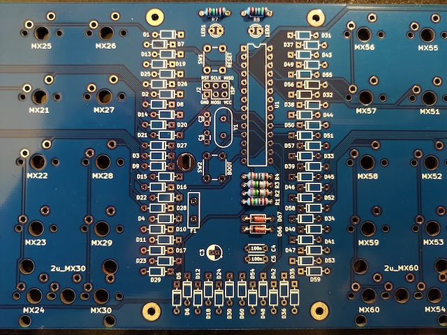

### Resistors for USB-C (R5,6)

If you are using a UCB-C connector you will need to solder these extra two resistors. They are in the kit along with the connector.

* R5,6: 5.1kΩ Green, brown, black, brown, red

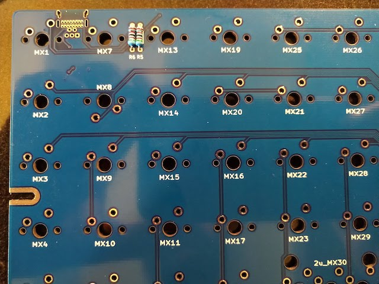

### Diodes 1N4148 (D1-60)

Solder the diodes.

Diodes are a polarized component and therefore take care of direction, the black line on the diode is the cathode and goes in the square pad on PCB.

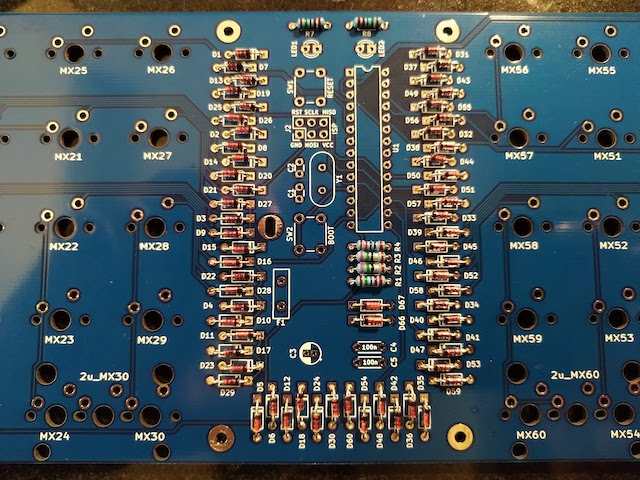

### Crystal (Y1)

Solder the crystal.

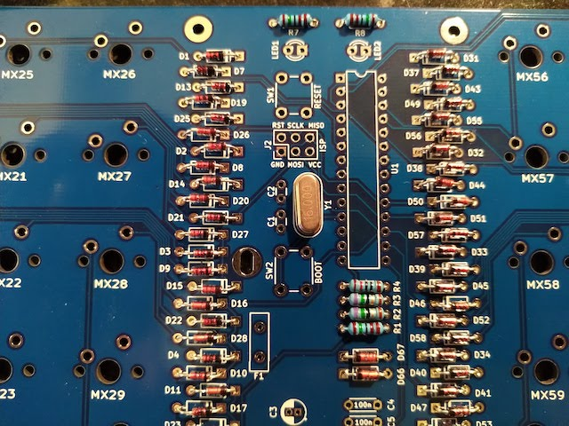

### Capacitors (C1,2,4,5)

Solder the small yellow 22pF capacitors C1 and C2 (marked 22, alternatively they may be small and brown in your kit).

Solder the small yellow 100nF capacitors C4 and C5 (marked 104).

Do not get the two sets of capacitors confused.

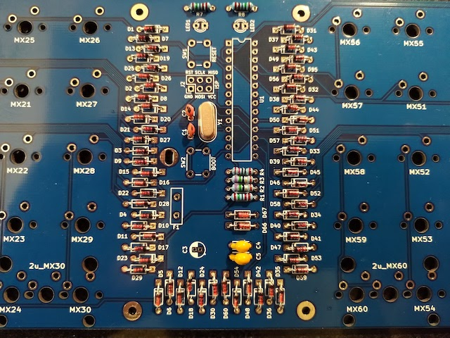

Leave C3 until later as it is tall and will stop the PCB from laying flat.

### USB connector (J1)
#### USB Mini

Place the USB connector into the footprint on the underside of the PCB, it should stay put while you solder all of the pins (including the 2 feet).

If not, solder one foot first, then reheat the pad while pressing the connector into place so that it sits flush on the PCB. Then solder the other foot and the pins.

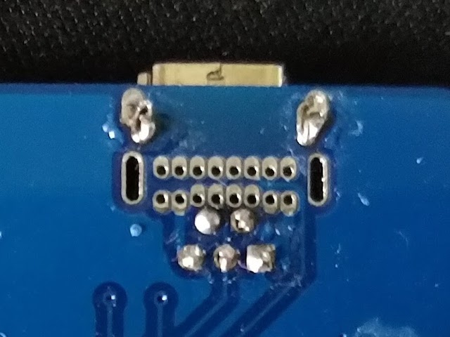

#### USB Type-C

If you are installing a USB-C connector ensure you have installed the two extra resistors (R5 & R6).

Due to the small size of the pins on the connector you will need to use a different soldering technique called drag soldering.

* Insert the USB connector into the board, the pins are very small and might need bending slightly so that they align correctly.
* Flip the board over and solder one of the legs into place.
* Reheat the pad and press the USB port firmly into place to ensure it sits flat before then soldering the other 3 legs.
* Apply no-clean flux across all of the small pins.
* Apply a small amount of solder to your iron and drag it across the pins, repeat until all holes are filled with solder.
* The flux will cause the solder to flow to the pins and avoid creating solder bridges between the pins.
* Add more flux as needed as you go along.
* Use your iron between the pads to remove any solder bridges.
* Check the solder joints carefully, under a magnifying glass if needed, to ensure there are no bridges between pads.

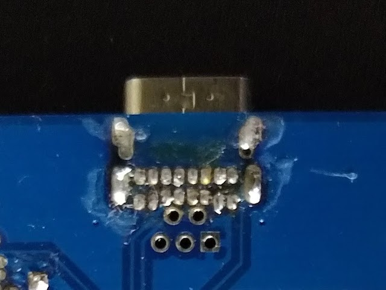

If you have a multimeter you can use it to check for bridges, check that the following pins connect to each other and all others do not:
 
* Top 1 & 8, bottom 1 & 8 are ground pins and should all connect to each other and the square ground pad of the USB-mini footprint.
* Top 2 & 7, bottom 2 & 7 are V+ pins and should all connect to each other and the round bottom left pad of the USB-mini.
* Top 4 & bottom 5 are D- pins and should connect to top left pad of the USB-mini.
* Top 5 & bottom 4 are D+ pins and should connect to bottom center pad of the USB-mini.
* Bottom 3 is the CC1 pin and should connect to the top pad of the R5 resistor.
* Top 6 is the CC2 pin and should connect to the top pad of the R6 resistor.

### LEDs (LED1,2)

Solder the LEDs.

LEDs are a polarized component and therefore take care of direction, the short leg is the cathode and goes in the square pad on PCB.

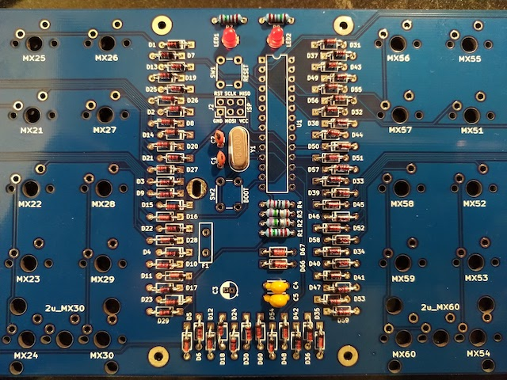

### IC socket (U1)

Solder on the IC socket. 

The IC socket mounts a polarized component, check the notch on silkscreen and IC Socket.

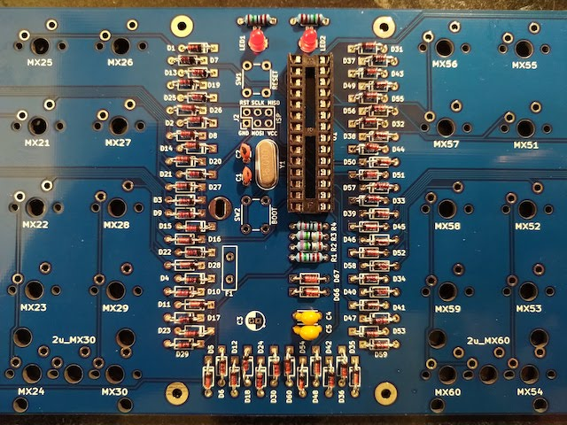

Do not insert microcontroller into the socket before soldering the socket to the PCB.

### Electrolytic capacitor (C3)

Electrolytic capacitor is a polarized component, the short leg is the cathode and goes in the circular (left) pad on PCB.

The soldermask around the pads can cause confusion about which is the square pad as the circular pad has a square soldermask pattern around it, so be careful and double check. If in doubt, the capacitor should be orientated so that the side with the white line on it is on the left.

To fit under the component cover, ensure that your capacitor body is less than 10mm tall.

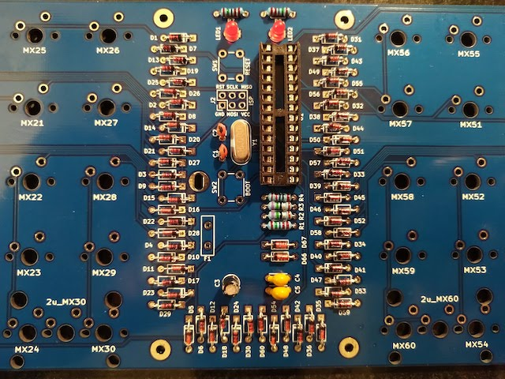

### Resettable fuse (F1)

Solder on the resettable fuse.

After soldering, bend the fuse over to that it lays flat on the PCB.

### Tactile switches (SW1,2)

Push the switches into the PCB and solder the legs.

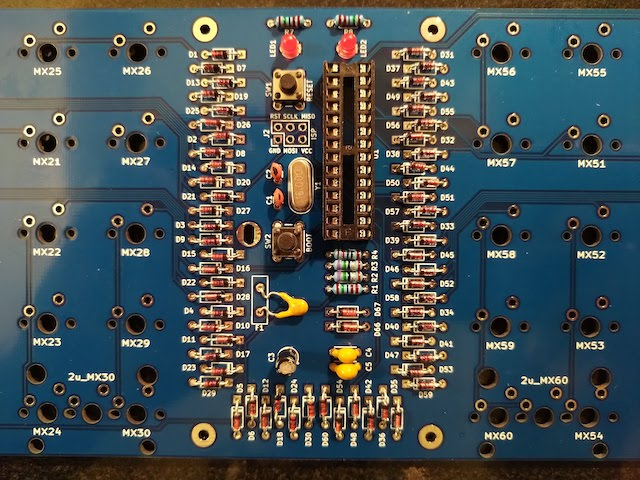

### ISP header (J2)

Used for programming the microprocessor with the bootloader directly. If your MCU is already programmed you can skip adding this header if you want.

### ATMEGA328P (U1)

Insert ATMEGA328P into IC Socket.

Ensure that you insert it in the correct orientation, the semicircular mark should match that of the silkscreen.

### Check list

Before connecting the board to your computer, a few things to double check just to be safe:

* Take a close look at the USB connector pins and visually check there is no short between the VCC and GND pins. If you have a multimeter, now might be a good time to use it.
* Check the orientation of polarized components (ATMEGA328p, diode, electrolytic capacitor).
* Double check the correct resistor values are in the correct locations.

## Software

Note: If you got your Lumberjack as a kit, the microprocesor is already flashed with a bootloader and firmware, and you can skip this and the firmware steps.

### Bootloader

A bootloader is a piece of software on the microprocessor which can be used to flash firmware onto the microprocessor and to pass execution control to that firmware.

You will need to flash the microprocessor with a bootloader. To do this you will need another device which can be connected to the ISP headers and used to flash the bootloader to the chip. Since Lumberjack is the same as the Plaid, we can use the same bootloader.

* Download the [Plaid bootloader](https://github.com/hsgw/USBaspLoader/tree/plaid) and follow the instructions to compile the bootloader.
* Follow the [QMK ISP flashing guide](https://beta.docs.qmk.fm/using-qmk/guides/keyboard-building/isp_flashing_guide) to get the bootloader onto the chip.

Don't forget to set the fuses: low `0xd7`, high `0xd0`, extended `0xd0`.

### Firmware

Follow the [QMK firmware instructions](https://beta.docs.qmk.fm/using-qmk/guides/flashing/flashing) to build and flash the firmware.

`qmk flash -kb peej/lumberjack`

To put the board into bootloader mode so it is ready to recieve firmware, press and hold the BOOT button (SW2) while pressing and releasing the RESET button (SW1). The board will now be detected as an USBasp device and can have the firmware flashed via the USB port.

Pressing the RESET button (SW1) on its own will restart the microprocessor. Once flashed with firmware it is neccessary to reset the keyboard so as to return control to the new firmware.

Note that due to the BOOT button (SW2) sharing a pin with column 3, when pressed the keys in that column will also activate. This is expected behavour but can be a little annoying or confusing if you are not expecting it.

### Can't recognize bootloader

* Check components and soldering near ATMEGA328p.
    * Direction of ATMEGA328p
    * BOOT SW and RESET SW
    * USB connector
    * R1, R2, R3, D66, D67
* Try different USB cable, PC, USB hub
    * If you connect via USB hub, try connecting directly.

### Check list

Now the board should be fully functional, so check that everything works before adding the switches.

Plug in the PCB and use a pair of tweazers or a piece of wire to check each keyswitch pad triggers a keypress.

## Switches

### Stabilizers

If you are using 2u keys and want to use key stabilizers, fix them to the board before inserting the switches.

### Trim switch legs

When fitting key switches, the switches at the 'Q' and 'P' positions on the 2nd row will fowl on the standoffs in your keyboard case, so you need to trim down one of the stabilizing pins and part of the center pin to ensure the PCB fits flush within the case.

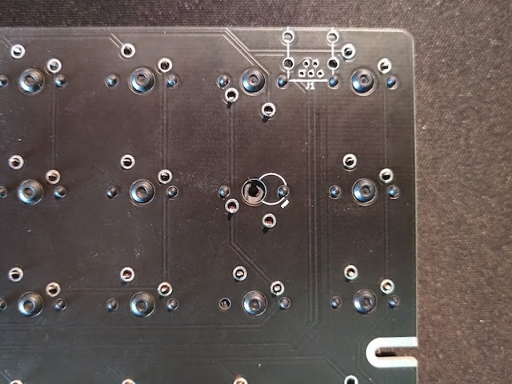

If you are using a 2u key on the right hand side, you will also need to trim down the center pin so that it does not fowl on the standoff. The position the case standoffs will be is marked on the soldermask of the underside of the PCB.

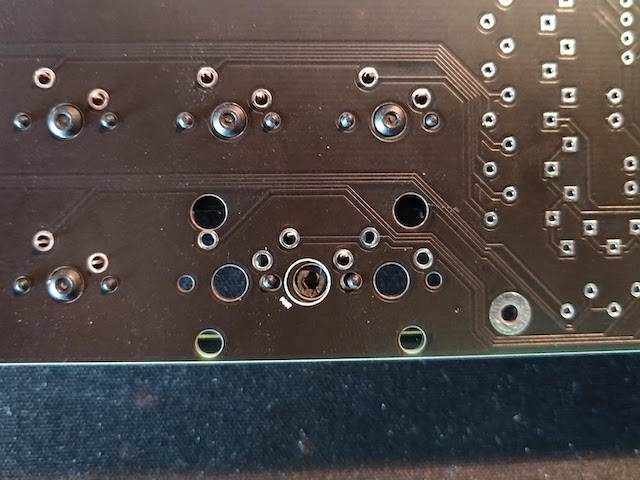

### Insert switches

Insert the switches into the PCB and solder the pins of each switch.

If you are using a plate, insert the switches into the plate first and then insert into the PCB.

Ensure that the switch is fully inserted and sitting flush with the PCB before soldering.

Note also that the switch at the 'Q' position is upsidedown so that the switch pins do not interfere with the case standoffs.

## Component cover

Affix the 4 standoffs to the PCB with screws from underneath the PCB. Use the remaining 4 screws to attach the acrylic to the top of the standoffs.

Do not overtighten the screws as this could crack the acrylic.

## Case fitting

When fixing the PCB to your case you will only use the center, the left and the right screw holes. Depending on your case design, the PCB will be supported by the other standoffs.

## End

Congratulations, your build is complete.
